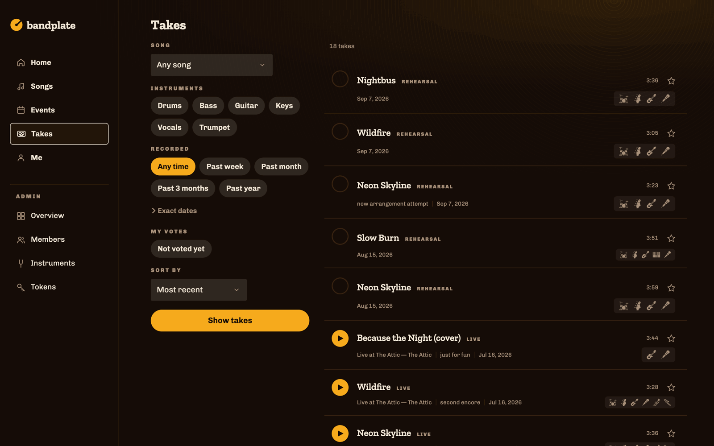
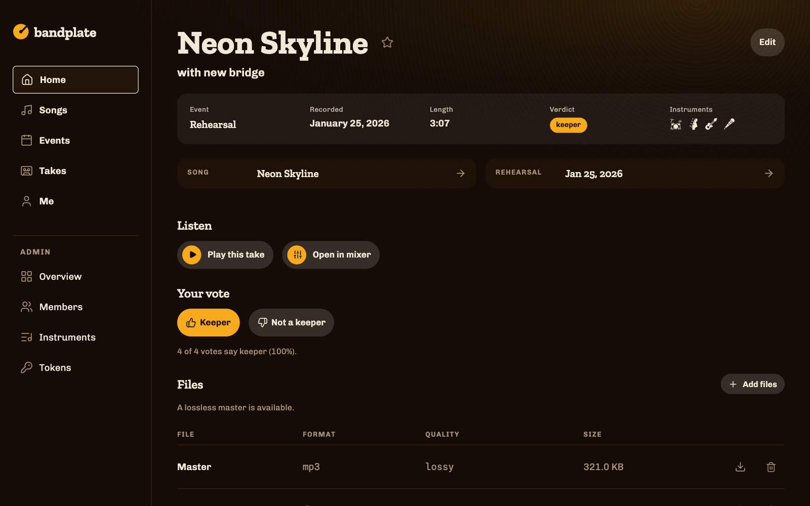
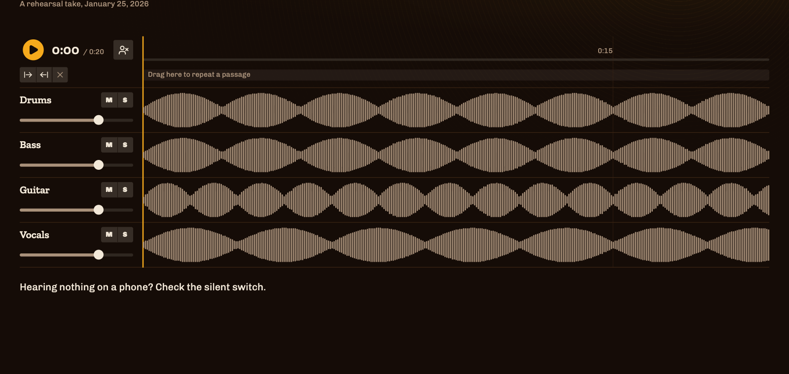
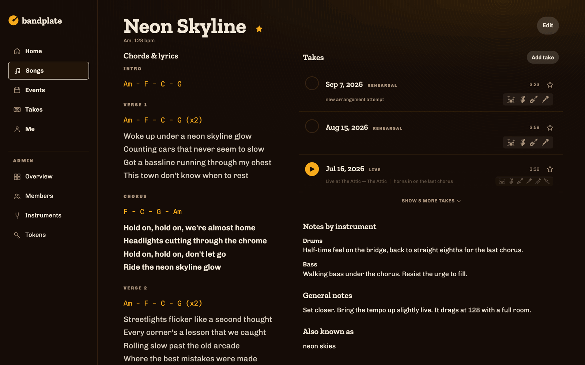
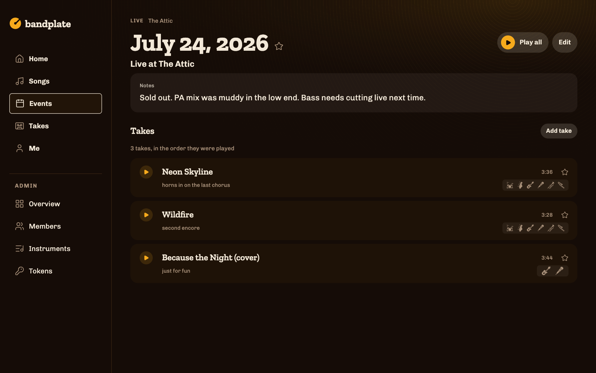
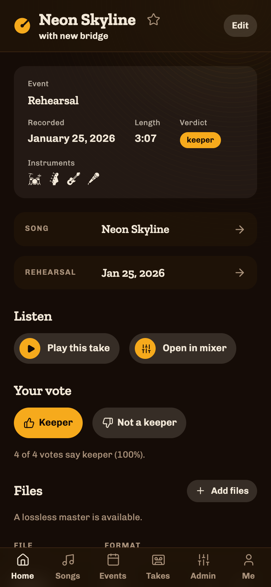
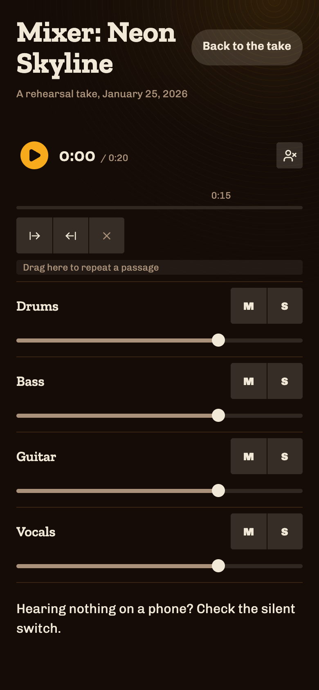

# bandplate

**A self-hosted archive for a band's own rehearsal recordings.** Browse
every take you have ever played, hear it, argue about which one was the
keeper, and practise against it with your own part muted.

[](https://github.com/bandplate/bandplate/actions/workflows/ci.yml)



## Why this exists

Recording a rehearsal is easy now. Every band with an interface and a laptop
has years of multitrack audio sitting somewhere.

What nobody has is a way to *use* it. The recordings end up in a shared drive
as `2024-11-07 rehearsal 2.wav`, four gigabytes at a time, and the honest
truth is that nobody opens them again. You cannot find the take of the song
you are trying to remember. You cannot tell which of the six attempts was the
one everyone liked, because that was decided out loud in a room eight months
ago. And the drummer who wants to practise the new arrangement at home has
nothing to play along to except a mix with the drums already in it.

The commercial options are band-management suites: setlists, gig calendars,
file storage, a monthly bill, and your band's unreleased material on somebody
else's server. None of them treat a rehearsal recording as the thing worth
keeping.

So bandplate does one job. It is a library of **takes** — one run-through of
one song, on one date — with the metadata that makes a take findable, a vote
so the band can agree in writing which ones are keepers, and a mixer that
plays the separate instrument tracks together so you can mute your own and
play along. It runs on your own hosting, and the whole thing is a few
megabytes plus however much audio you feed it.

It was built for one band's weekly rehearsals and is in real use. It is not a
product, and there is no hosted version.

## What you get

**A take is the unit.** Not a file, not a session: one performance of one
song. It carries the song, the date, the event it came from, its length, the
instruments audible in it, a note ("with new bridge", "second encore"), and
the band's votes.



**A stem mixer**, when the recording came in with separate instrument tracks.
Every stem plays together on one timeline, each with mute, solo and a fader,
plus a loop region for the eight bars you keep getting wrong. One button
mutes the instruments *you* play, which is the whole point: rehearsal at home
against the band you actually play with.



It streams rather than decoding. Seven stems of a seven-minute take would be
about a gigabyte of decoded audio, so the engine runs one `<audio>` element
per stem through Web Audio and corrects the drift between them. The tradeoff
is honest and written down: this is a practice tool, not a DAW, and the loop
jumps rather than being seamless.

**Songs carry the working knowledge** — chords, lyrics, key and tempo,
per-instrument notes, alternate titles — and list every take of that song in
one place.



**Events group takes** as they were actually played: a rehearsal, or a gig in
running order.



**It works on a phone**, because that is where you use it — in the rehearsal
room, or on the way there. The mixer degrades to a track list and one shared
position strip rather than a miniature DAW, and the loop still works.

<p>
  
  
</p>

**Everything else is deliberately small.** Sign-in is a link in an email, no
passwords. Members are added by an admin. Two languages ship (English and
Czech) and adding a third is a file. There is no chat, no calendar, no
invoicing.

## The other half: reapertoire

Getting audio *in* is its own problem, and it lives in a separate repo.

[**reapertoire**](https://github.com/bandplate/reapertoire) works inside
REAPER: it finds where each run-through starts and stops in an hour of
continuous recording, recognises which song it was against the takes you
named last time, renders a master plus per-instrument stems, and pushes the
lot to bandplate over the ingest API.

The two are independent. bandplate's ingest API is a documented HTTP contract
([`docs/ingest-contract-v1.md`](docs/ingest-contract-v1.md)), and anything
that can speak it will do. reapertoire is the reference client, not a
dependency — and you can upload files by hand in the web UI instead.

## Try it locally

```sh
corepack enable
pnpm install

# audio has to live in a bucket; this starts MinIO and creates one
cd deploy/node && docker compose up -d minio minio-init && cd ../..

cp apps/web/.env.example apps/web/.env      # the defaults match the above
BANDPLATE_DATABASE_URL=file:./apps/web/.data/bandplate.db \
  pnpm --filter @bandplate/db run migrate

# a demo band: songs, events, takes, votes — and, with ffmpeg on PATH,
# real playable audio behind them
BANDPLATE_DATABASE_URL=file:./apps/web/.data/bandplate.db \
  pnpm --filter @bandplate/db run seed
BANDPLATE_DATABASE_URL=file:./apps/web/.data/bandplate.db \
  pnpm --filter @bandplate/db run dev:upload-audio

pnpm --filter web dev
```

Then open `/setup` and create yourself as the first admin, using the
bootstrap token from your `.env`. Login links are printed to the server
console in dev, so no mail server is needed.

**For a real deployment**, follow [`docs/self-hosting.md`](docs/self-hosting.md)
instead — it covers the configuration that matters, including the one
variable (`BANDPLATE_TRUSTED_PROXY_DEPTH`) that is a security decision rather
than a value.

## How it is built

Astro 5 in server mode with Preact islands, Hono for the JSON API, Drizzle
over SQLite, Tailwind v4, TypeScript throughout, Biome, Vitest.

```
apps/
  web/            The Astro app, and the composition root: reads env, builds
                  the db/mailer/rate limiter, hosts the auth and admin
                  screens, and mounts packages/api under /api/*.
packages/
  core/           Domain layer. Runtime-agnostic, no node:* imports.
  db/             Drizzle schema, repos and migrations. Runtime-agnostic.
  api/            Hono app (createApp), mounted under /api by apps/web.
  mail/           Mailers: console/null/capturing, plus SMTP behind its own
                  @bandplate/mail/smtp entry point, so importing the barrel
                  never pulls in nodemailer.
  storage/        Object storage. S3Storage (aws4fetch SigV4, works against
                  MinIO and R2) is runtime-agnostic; InMemoryStorage, a
                  conformance-tested fake on the ./testing entry point, is
                  the one place here that touches node:*.
  i18n/           Message catalogs, English and Czech, with a parity test.
  ui/             Design tokens and shared primitives (Tailwind v4 theme).
deploy/
  node/           compose.yml — local-dev MinIO and bucket creation. Not a
                  production deploy recipe.
  worker/         The R2 CORS rule the mixer needs.
tools/
  ingest_client/  A minimal reference ingest client, in Python.
```

`core`, `db`, `api` and `storage` must run unmodified on Cloudflare Workers:
no `node:*` imports, no Node-only globals, enforced by a test. Node-specific
code (env reads, the SMTP mailer, the libSQL client) is confined to
`apps/web`, which is what lets the same tree build for either target.

Brand values are not hardwired into components. Colours and fonts live in
`packages/ui/src/tokens/*.css` as a swappable layer, so a band that wants a
different look changes that and nothing else.

Two documents are worth reading before changing anything:
[`CLAUDE.md`](CLAUDE.md) for the conventions, and
[`docs/frontend-traps.md`](docs/frontend-traps.md) for the things in this
stack that fail silently.

## Status

In real weekly use by the band it was built for, which means the paths that
band walks are solid and the ones it does not are less so. Expect rough edges
outside the core loop.

Issues and pull requests are welcome. `pnpm typecheck && pnpm lint &&
pnpm test` should all exit 0 before you open one.

### This was vibecoded

All of it. Every line here was written by an LLM, from prompts and review
rather than from a keyboard. That is the whole provenance and you should
factor it in.

What that does not mean: it is not a demo. It runs a real band's archive
every week, the test suite is real and passes, and the decisions that were
hard are argued out in comments at the point they apply — why the mixer
streams instead of decoding, why foreign keys are off, why the CSRF check is
hand-rolled. Those arguments are the useful part of the codebase.

What it does mean: no human has read every line. Reviewed, directed and used
in anger, yes; line-by-line audited, no. So if you are going to run this
somewhere that matters, read the parts that would hurt you — the auth flow,
the rate limiter, the presigning in `packages/storage`, and
`BANDPLATE_TRUSTED_PROXY_DEPTH`, which is a security decision the config
cannot make for you. I would say that about any small self-hosted project;
here it is worth saying out loud.

## Licence

MIT — see [LICENSE](LICENSE).

Instrument icons are from [Game Icons](https://game-icons.net/), licensed
[CC BY 3.0](https://creativecommons.org/licenses/by/3.0/).
