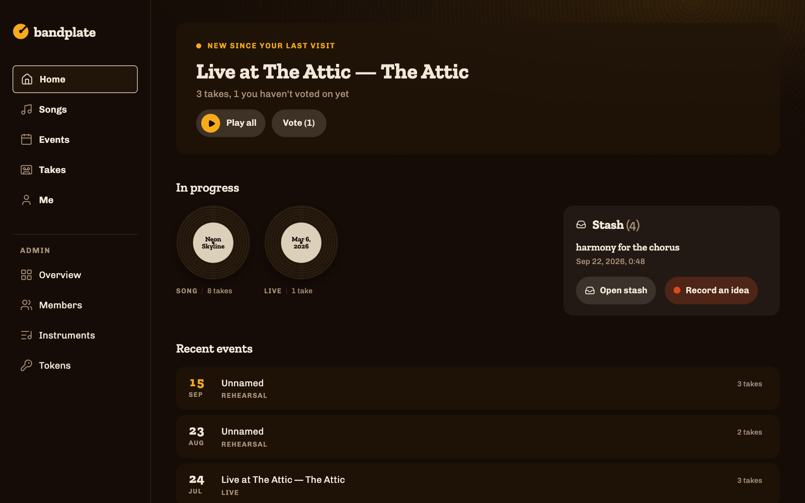
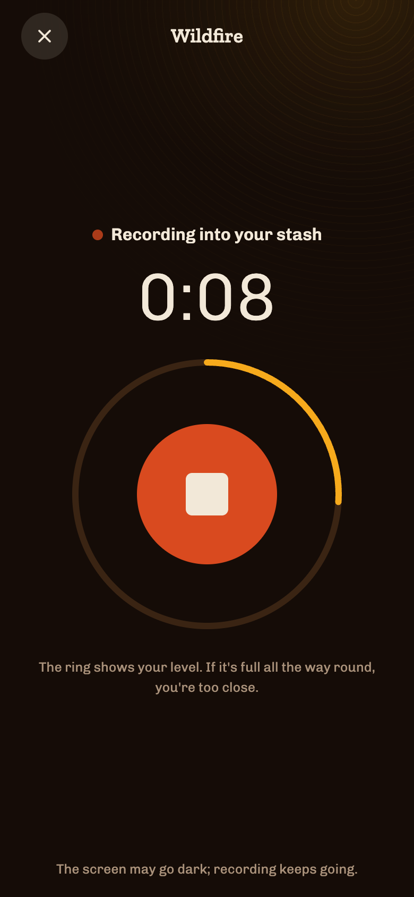
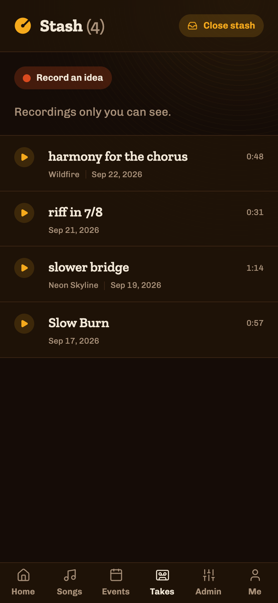
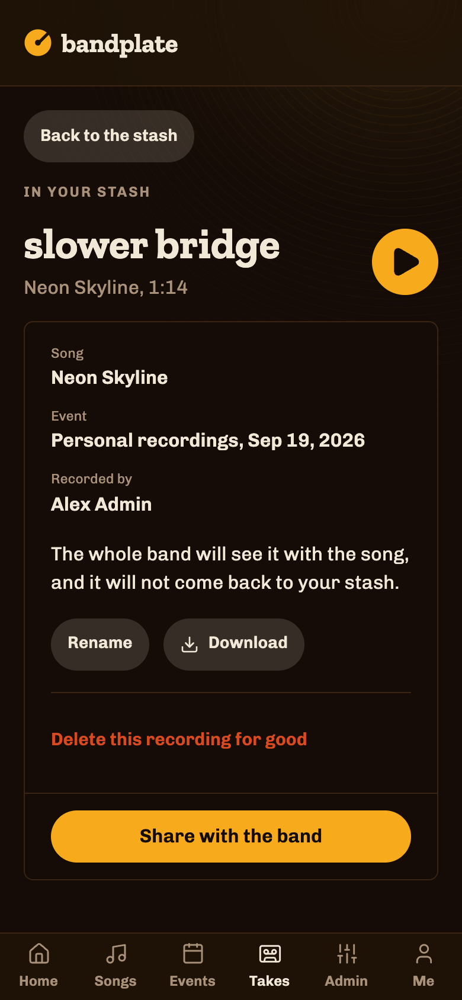
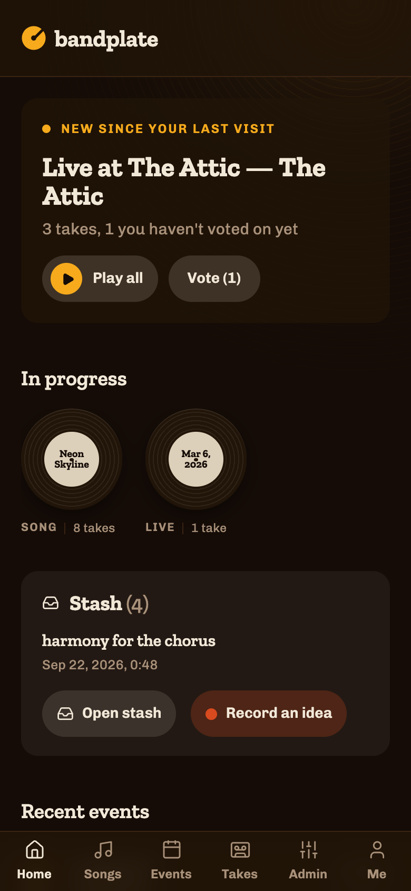
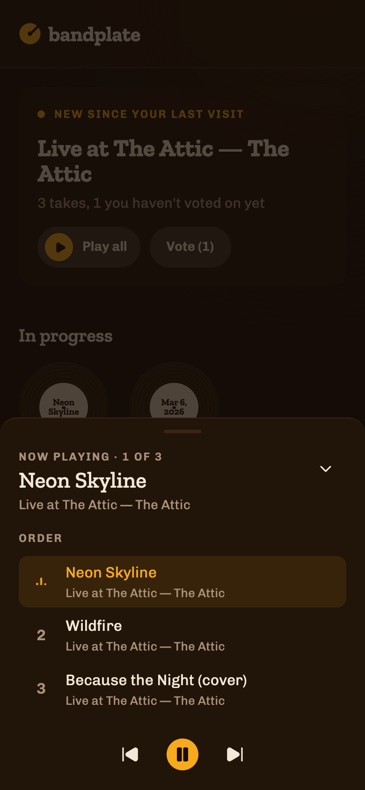

# bandplate

**A self-hosted archive for a band's own rehearsal recordings.** Browse
every take you have ever played, hear it, argue about which one was the
keeper, and practise against it with your own part muted.

[](https://github.com/bandplate/bandplate/actions/workflows/ci.yml)


## Why this exists

Recording a rehearsal is easy now. Every band with an interface and a laptop
has years of multitrack audio sitting somewhere.

What nobody has is a way to *use* it. The recordings end up in a shared drive
as `2024-11-07 rehearsal 2.wav`, four gigabytes at a time, and the honest
truth is that nobody opens them again. You cannot find the take of the song
you are trying to remember. You cannot tell which of the six attempts was the
one everyone liked, because that was decided out loud in a room eight months
ago. And the drummer who wants to practise the new arrangement at home has
nothing to play along to except a mix with the drums already in it.

The commercial options are band-management suites: setlists, gig calendars,
file storage, a monthly bill, and your band's unreleased material on somebody
else's server. None of them treat a rehearsal recording as the thing worth
keeping.

So bandplate does one job. It is a library of **takes** — one run-through of
one song, on one date — with the metadata that makes a take findable, a vote
so the band can agree in writing which ones are keepers, and a mixer that
plays the separate instrument tracks together so you can mute your own and
play along. It runs on your own hosting, and the whole thing is a few
megabytes plus however much audio you feed it.

It was built for one band's weekly rehearsals and is in real use. It is not a
product, and there is no hosted version.

## What you get

**A take is the unit.** Not a file, not a session: one performance of one
song. It carries the song, the date, the event it came from, its length, the
instruments audible in it, a note ("with new bridge", "second encore"), and
the band's votes. Voting is two buttons, Keeper and Not a keeper, and the
take page says how the band split.


**Home says what is new.** The first card is the newest event with takes
published since your last visit, with Play all and a Vote button counting
the ones you have not voted on yet. Under it sit the things you starred and
your stash, then the last few events.



**A stem mixer**, when the recording came in with separate instrument tracks.
Every stem plays together on one timeline, each with mute, solo and a fader,
plus a loop region for the eight bars you keep getting wrong. One button
mutes the instruments *you* play, which is the whole point: rehearsal at home
against the band you actually play with.


It streams rather than decoding. Seven stems of a seven-minute take would be
about a gigabyte of decoded audio, so the engine runs one `<audio>` element
per stem through Web Audio and corrects the drift between them. The tradeoff
is honest and written down: this is a practice tool, not a DAW, and the loop
jumps rather than being seamless.

**Songs carry the working knowledge** — chords, lyrics, key and tempo,
per-instrument notes, alternate titles — and list every take of that song in
one place, with your own stash recordings of it underneath.


**Events group takes** as they were actually played: a rehearsal, or a gig in
running order. Play all queues the whole event in that order.


**The stash is for ideas that are not takes yet.** A riff on the bus, a
harmony you want to try, the bridge at half speed. Record an idea opens a
full-screen recorder on the phone; the song is optional, and a recording
made with no signal waits on the device and uploads when it can. It lands
in your stash (*Šuplík* in Czech), a drawer in Takes that nobody else can
see. When one is worth hearing, Share with the band makes it a take of its
song (it asks which, if you never said), filed under a "Personal
recordings" day that says whose it is. Shared ideas are not voted on and
send nobody a notification. Sharing is one-way.

<p>
  
  
  
</p>

**It works on a phone**, because that is where you use it — in the rehearsal
room, or on the way there. The mixer degrades to a track list and one shared
position strip rather than a miniature DAW, and the loop still works. A
queue started with Play all keeps going from page to page, and the player
opens into a sheet with the running order.

<p>
  
  
</p>

<p>
  
  
</p>

It installs to the home screen as an app, and if the server has push keys
configured, each member can turn on notifications per device: new takes
from rehearsals, a Sunday reminder about takes still waiting for your vote,
and new songs or chord and lyric changes.

**Everything else is deliberately small.** Sign-in is a link in an email, no
passwords. Members are added by an admin. Two languages ship (English and
Czech) and adding a third is a file. The theme is light, dark or the
device's own, remembered per browser. There is no chat, no calendar, no
invoicing.

## Feeding it from your DAW

You can drag files into the web UI, and for one take that is fine. For a
rehearsal that produced fourteen takes with stems, you want the DAW to push
them, and **that is a documented, versioned HTTP contract anyone can write
against** — not a plugin API, not an integration you have to be blessed for.

The happy path is three calls to the app, plus the upload itself:

```
POST /api/ingest/v1/events           → declare the rehearsal, get its id
POST /api/ingest/v1/takes            → declare a take + its files,
                                       get a presigned PUT URL for each
PUT  <presigned url>                 → upload straight to the bucket
POST /api/ingest/v1/takes/{id}/commit → hashes match, publish it
```

Audio never passes through the app: it goes to your bucket directly, so a
bridge needs no streaming and the server needs no upload capacity.

What makes it pleasant to write against:

- **Everything is idempotent.** You supply the client reference for an event
  and a take, so re-posting returns the existing row rather than a duplicate.
  An asset whose hash and size already match is skipped. A run that died on
  take nine resumes without re-uploading the first eight, and a presigned URL
  that expired under a slow uplink is refreshed rather than failing the run.
- **It validates up front.** Instrument slugs are checked against the live
  vocabulary at `GET /api/ingest/v1/instruments`, so a bridge can fail before
  it declares anything rather than stranding a half-ingested take.
- **A machine-readable spec**, served by the app itself and needing no token:
  `GET /api/ingest/v1/openapi.json`. Point a generator at your own
  deployment.
- **Scoped tokens.** `/admin/tokens` issues one with `ingest:write` and
  nothing else, which is the only scope any ingest route checks. A token that
  leaks off a laptop cannot read votes or touch members.

[`docs/ingest-contract-v1.md`](docs/ingest-contract-v1.md) is the contract in
full, and `tools/ingest_client/` is a working client in about 400 lines of
Python with no dependencies — short enough to read in one sitting and use as
a skeleton for your own.

### reapertoire, the reference bridge

[**reapertoire**](https://github.com/bandplate/reapertoire) is what that
looks like built out properly, for REAPER. It finds where each run-through
starts and stops in an hour of continuous recording, recognises which song it
was against the takes you named last time, renders a master plus
per-instrument stems, and pushes the lot over the contract above.

It is a separate repo and not a dependency. If you use a different DAW, the
contract is the whole interface — and the bridge you write is a render step
plus the four lines above.

## Try it locally

You need Node 22.23.2 or newer, Docker for the bucket, and `ffmpeg` if you
want the demo takes to have audio.

```sh
corepack enable
pnpm install

# audio has to live in a bucket; this starts MinIO and creates one
# (port 9000 already taken? set S3_HOST_PORT and use that port below)
cd deploy/node && docker compose up -d minio minio-init && cd ../..

cp apps/web/.env.example apps/web/.env
# in apps/web/.env: uncomment BANDPLATE_ALLOW_DEV_MAILER=true and set
# BANDPLATE_COOKIE_SECURE=false; the S3_* defaults already match MinIO

# the file the app opens (.env says ./.data/bandplate.db, from apps/web).
# pnpm --filter runs each script in its own package, so give it in full.
export BANDPLATE_DATABASE_URL=file:$PWD/apps/web/.data/bandplate.db
pnpm --filter @bandplate/db run migrate

# a demo band: songs, events, takes, votes
pnpm --filter @bandplate/db run seed

# real playable audio behind the seeded takes; needs ffmpeg on PATH
S3_ENDPOINT=http://localhost:9000 S3_PUBLIC_ENDPOINT=http://localhost:9000 \
  S3_BUCKET=bandplate S3_REGION=auto \
  S3_ACCESS_KEY_ID=bandplate-dev S3_SECRET_ACCESS_KEY=bandplate-dev-secret \
  pnpm --filter @bandplate/db run dev:upload-audio

pnpm --filter web dev
```

Then open <http://localhost:4321/login> and sign in as the seeded admin,
`admin@example.com`. In dev the sign-in link is printed to the server
console instead of emailed, so no mail server is needed. Without the seed,
open `/setup` instead and create yourself as the first admin with the
bootstrap token from your `.env`.

**For a real deployment**, follow [`docs/self-hosting.md`](docs/self-hosting.md)
instead. It covers the configuration that matters, including the one
variable (`BANDPLATE_TRUSTED_PROXY_DEPTH`) that is a security decision rather
than a value. To run on Cloudflare Workers with D1 and R2, follow
[`docs/deploy-cloudflare.md`](docs/deploy-cloudflare.md).

## How it is built

Astro 7 in server mode with Preact islands, Hono for the JSON API, Drizzle
over SQLite, Tailwind v4, TypeScript throughout, Biome, Vitest. The same tree
builds for Node 22 (libSQL, any S3-compatible bucket) or for Cloudflare
Workers (D1 and R2).

```
apps/
  web/            The Astro app, and the composition root: reads env, builds
                  the db/mailer/rate limiter, hosts the auth and admin
                  screens, and mounts packages/api under /api/*.
packages/
  core/           Domain layer. Runtime-agnostic, no node:* imports.
  db/             Drizzle schema, repos and migrations. Runtime-agnostic.
  api/            Hono app (createApp), mounted under /api by apps/web.
  mail/           Mailers: console/null/capturing, plus SMTP behind its own
                  @bandplate/mail/smtp entry point, so importing the barrel
                  never pulls in nodemailer.
  storage/        Object storage. S3Storage (aws4fetch SigV4, works against
                  MinIO and R2) is runtime-agnostic; InMemoryStorage, a
                  conformance-tested fake on the ./testing entry point, is
                  the one place here that touches node:*.
  push/           Web Push: VAPID keys and the sender, runtime-agnostic.
  i18n/           Message catalogs, English and Czech, with a parity test.
  ui/             Design tokens and shared primitives (Tailwind v4 theme).
deploy/
  node/           compose.yml: local-dev MinIO and bucket creation. Not a
                  production deploy recipe.
  worker/         The R2 CORS rule the mixer needs.
tools/
  ingest_client/  A minimal reference ingest client, in Python.
```

`core`, `db`, `api`, `storage` and `push` must run unmodified on Cloudflare Workers:
no `node:*` imports, no Node-only globals, enforced by a test. Node-specific
code (env reads, the SMTP mailer, the libSQL client) is confined to
`apps/web`, which is what lets the same tree build for either target.

Brand values are not hardwired into components. Colours and fonts live in
`packages/ui/src/tokens/*.css` as a swappable layer, so a band that wants a
different look changes that and nothing else.

Two documents are worth reading before changing anything:
[`CLAUDE.md`](CLAUDE.md) for the conventions, and
[`docs/frontend-traps.md`](docs/frontend-traps.md) for the things in this
stack that fail silently.

## Status

In real weekly use by the band it was built for, which means the paths that
band walks are solid and the ones it does not are less so. Expect rough edges
outside the core loop.

Issues and pull requests are welcome. `pnpm typecheck && pnpm lint &&
pnpm test` should all exit 0 before you open one.

### This was vibecoded

All of it. Every line here was written by an LLM, from prompts and review
rather than from a keyboard. That is the whole provenance and you should
factor it in.

What that does not mean: it is not a demo. It runs a real band's archive
every week, the test suite is real and passes, and the decisions that were
hard are argued out in comments at the point they apply — why the mixer
streams instead of decoding, why foreign keys are off, why the CSRF check is
hand-rolled. Those arguments are the useful part of the codebase.

What it does mean: no human has read every line. Reviewed, directed and used
in anger, yes; line-by-line audited, no. So if you are going to run this
somewhere that matters, read the parts that would hurt you — the auth flow,
the rate limiter, the presigning in `packages/storage`, and
`BANDPLATE_TRUSTED_PROXY_DEPTH`, which is a security decision the config
cannot make for you. I would say that about any small self-hosted project;
here it is worth saying out loud.

## Licence

MIT — see [LICENSE](LICENSE).

Instrument icons are from [Game Icons](https://game-icons.net/), licensed
[CC BY 3.0](https://creativecommons.org/licenses/by/3.0/). Interface icons
are from [Lucide](https://lucide.dev/), licensed ISC.
